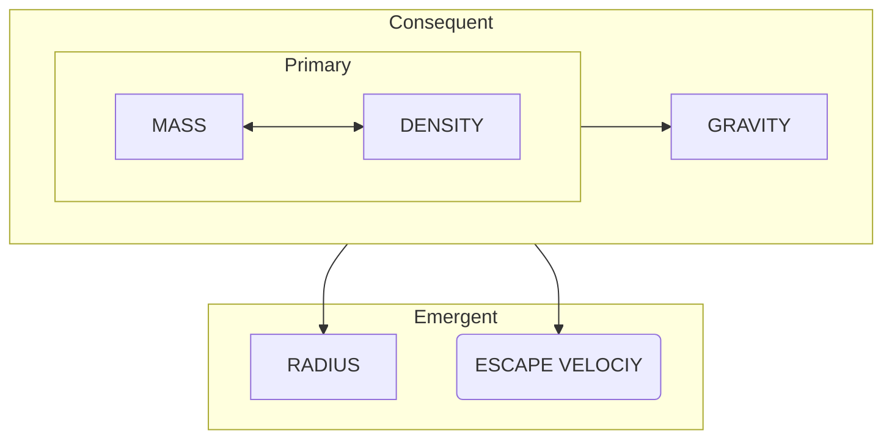

# Duramonic Physical Parameters

Duramonic bodies are defined by five quantitative parameters, each belonging to a distinct tier of causality. Two of these — mass and density — describe the duramon’s intrinsic matter. Their interaction produces the consequent parameter, surface gravity. And together, these three generate the emergent geometric and energetic properties: radius and escape velocity.

Duramonic parameters are grouped into tiers not by convenience, but by causality: primaries _define_ the consequent, and together they _generate_ the emergent.

## Primary Parameters

**Mass** ($m$):  
The total amount of matter the duramon contains.  
*Mass is invariant* — it does not change with location or gravity.  
> *Mass and weight are not the same: weight depends on gravity, but mass does not.*

**Density** ($ρ$):  
The average amount of matter per unit volume — how tightly the duramon’s material is packed. Density depends on both composition (rock, ice, metal, etc.) and, for larger bodies, gravitational self-compression.

## Consequent Parameter

**Surface Gravity** ($g$):  
The strength of gravitational acceleration at the duramon’s surface — how strongly it attracts objects located one radius away from its center.  

Gravity is **consequent**, arising from the interaction of mass and density:

$$
g = \sqrt[3]{mρ^{2}}
$$

Together, **mass**, **density**, and **gravity** form the **consequential parameters** of the duramon.  
They describe what the body *is* and how it *acts* gravitationally.

## Emergent Parameters

**Radius** ($r$):  
The distance from the duramon’s center to its surface.  
Although it may appear independent, radius is actually a *derived property*, emerging from the balance of mass and density:

$$
r = \frac{g}{ρ} = \sqrt{\frac{m}{g}} = \sqrt[3]{\frac{m}{ρ}}
$$
A duramon’s radius is not an independent trait — it’s the geometric expression of how much matter the body contains _given_ how tightly it is packed.

**Escape Velocity** ($v_e$):  
The minimum speed required to escape the duramon’s gravitational field when starting from its surface.  
This parameter emerges from the same consequentials:

$$
v_e = \frac{g}{\sqrt{ρ}} = \sqrt[4]{m\,g} = \sqrt[6]{m^{2}ρ}
$$
Escape velocity represents the energy threshold imposed by the duramon’s gravitational well — the “height” of its gravity.
## Hierarchy of Dependence

Duramonic parameters follow a clear causal chain, in which the **primary** parameters *define* the **consequent** parameter, and together these *form* the **emergent** parameters:

$$
\begin{gathered}
\text{Primaries} \xrightarrow{define} \text{Consequent} \xrightarrow{forms} \text{Emergent} \\[1em]
\text{or, in physical form:} \\[1em]
\left[(m,ρ) \xmapsto{\text{combine}} g \right] \xrightarrow{\text{yields}} (r, v_{e})
\end{gathered}
$$
The *fundamental mapping* of the physical properties of **mass** and **density** defines the consequent parameter, **gravity**.  This consequential operation, taken as a whole, yields the emergent duramonic parameters — **radius** and **escape** velocity.

- **Mass** and **density** define the duramon’s intrinsic substance.  
- **Gravity** arises as a direct *consequence* of those quantities.  
- **Radius** and **escape velocity** *emerge* from the interaction of all three.

Together these define the duramon’s **physical identity** — its body, field, and limit.

### A familiar analogy

The classic riddle “Which is heavier — a pound of iron or a pound of feathers?” demonstrates the independence of *mass* from *density*.  

Both *weigh* the same, but the feathers occupy far more *volume* because they are less dense.  

<!-- Link the word 'weigh' to explanation of the difference between >mass< and >weight<, located elsewhere. -->

The same principle applies on planetary scales: a rocky duramon and an icy duramon of equal mass can differ greatly in both radius and surface gravity.
